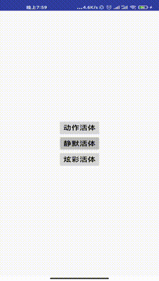

## 产品介绍
支持IOS/Android, 提供多种活体认证方式`(静默活体，炫彩活体，动作活体)`，对人进行认证，用户体验极佳，可用于人脸登录，刷脸支付，刷脸认证等场景，如下：



## 插件对外接口
插件地址 [https://ext.dcloud.net.cn/plugin?id=2486](https://ext.dcloud.net.cn/plugin?id=2486)
如下：
#### 初始化：init()
```python
/**
 * 认证初始化
 * @return JSONObject 包括如下字段
 *    code: 执行结果状态码
 *        FACEID_SUCCESS：执行成功
 *        FACEID_INVALID_PARAM：传入的参数异常
 *        FACEID_EXCEPTION：发生异常
 *    msg: 执行结果描述
 *    data 执行返回结果
 */
JSONObject eFaceIDModule.verifyInit()
```
#### 发起认证：void startVerify(JSONObject options, final JSCallback callback)
```javascript
/**
 * 认证初始化
 * @param options，入参 {"token":""}
 * @param callback: 执行完成回调,传入一个对象,包括如下字段
 *    code: 执行结果状态码
 *        FACEID_SUCCESS：执行成功
 *        FACEID_FAILED: 执行失败
 *        FACEID_PERMISSION：无法获得用户授权(camera以及写文件权限)
 *        FACEID_INVALID_PARAM：传入的参数异常
 *        FACEID_EXCEPTION：发生异常
 *    msg: 执行结果描述
 *    token: 认证token
 *    data 执行返回结果
 *    file data数据的文件存储路径（源数据，data是此数据的base64字符串）
 * @return void
 */
void eFaceIDModule.startVerify(JSONObject options, final JSCallback callback)
```
#### 获取活体视频数据：JSONObject getLivenessVideo(String decryptionKey)
```javascript
/**
 * 认证初始化
 * @param decryptionKey，解密视频文件的密钥(认证完成后从服务器端返回)
 * @return JSONObject 包括如下字段
 *    code: 执行结果状态码
 *        FACEID_SUCCESS：执行成功
 *        FACEID_FAILED: 执行失败
 *        FACEID_PERMISSION：无法获得用户授权(camera以及写文件权限)
 *        FACEID_INVALID_PARAM：传入的参数异常
 *        FACEID_EXCEPTION：发生异常
 *    msg: 执行结果描述
 *    token: 认证token
 *    data 活体视频数据(base64字符串)
 *    file data数据的文件存储路径（源数据，data是此数据的base64字符串）
 */
JSONObject eFaceIDModule.getLivenessVideo(String decryptionKey)
```
## DEMO
#### 伪代码
如下
```python
# 初始化
ret = eFaceIDModule.verifyInit()
# 服务器端初始化
rspMsg = sendToServer(ret)
# 发起刷脸认证操作
ret = eFaceIDModule.startVerify(rspMsg.token)
# 获取活体检测及刷脸认证结果
rspMsg = sendToServer(ret)
# 获取活体视频(可选)
ret = eFaceIDModule.getLivenessVideo(rspMsg.decryptionKey)
```

## 其他信息
1. 完整接入文档：[https://esandinfo.yuque.com/books/share/1b12aca9-d3d6-4011-ac9c-d379c84b71ab?#](https://esandinfo.yuque.com/books/share/1b12aca9-d3d6-4011-ac9c-d379c84b71ab?# )
2. 服务器端协议文档：[https://market.aliyun.com/products/57000002/cmapi00042648.html#sku=yuncode3664800001](https://market.aliyun.com/products/57000002/cmapi00042648.html#sku=yuncode3664800001)
3. 后端管理控制台地址: [http://openali.esandcloud.com](http://openali.esandcloud.com)
4. 技术支持
```
微信：esand_info
qq: 3626921591
电话：18033076802
邮箱：ruide.li@esandinfo.com
```

